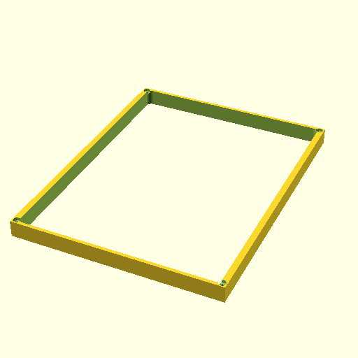

# Project Github Oomlout Oomlout Oobb Organizing Book Hardback Tray Inside Book Innard 200 Width 255 Height 15 mm Depth  

note: This is part of OOMP the Oopen Organization Method For Parts. For more details: https://github.com/oomlout/oomp_base

##  part details
  

### name
* name: Project Github Oomlout Oomlout Oobb Organizing Book Hardback Tray Inside Book Innard 200 Width 255 Height 15 mm Depth
* name_short: 
### id
* oomp_id: project_github_oomlout_oomlout_oobb_organizing_book_hardback_tray_inside_book_innard_200_width_255_height_15_mm_depth
  * classification: project
  * type: github
  * size: oomlout
  * color: oomlout_oobb_organizing_book_hardback_tray_inside
  * description_main: book_innard_200_width_255_height_15_mm_depth
  * description_extra: 
  * manufacturer: 
  * part_number: 
  * bip 39 word 2: seed state
  * bip 39 word 3: seed state submit
  * bip 39 word: seed state submit lecture six flower veteran sister invest loud fit auction

### other_codes
* short_code: 
* oomp_word: ambulance tophat trophy
* oomp_word_emoji :ambulance: :tophat: :trophy:
* md5_6_alpha: 9b9up
* md5_6: eeafa1

### all codes 
| key | value |  
| --- | --- |  
| classification | project |  
| classification_name | Project |  
| color | oomlout_oobb_organizing_book_hardback_tray_inside |  
| color_name | Oomlout Oobb Organizing Book Hardback Tray Inside |  
| description_extra |  |  
| description_extra_name |  |  
| description_main | book_innard_200_width_255_height_15_mm_depth |  
| description_main_name | Book Innard 200 Width 255 Height 15 mm Depth |  
| directory | parts/project_github_oomlout_oomlout_oobb_organizing_book_hardback_tray_inside_book_innard_200_width_255_height_15_mm_depth |  
| full_rotations | [0, 0, 0] |  
| full_shift | [0, 0, 0] |  
| github_link | https://github.com/oomlout/oomlout_oomp_part_src/tree/main/parts/project_github_oomlout_oomlout_oobb_organizing_book_hardback_tray_inside_book_innard_200_width_255_height_15_mm_depth |  
| id | project_github_oomlout_oomlout_oobb_organizing_book_hardback_tray_inside_book_innard_200_width_255_height_15_mm_depth |  
| id_oobb | oobb_part_oomlout_oobb_organizing_book_hardback_tray_inside_book_innard_200_width_255_height_15_mm_depth |  
| kwargs | {'filter': '', 'height': 255, 'modes': ['3dpr'], 'navigation': True, 'oomp_classification': 'project', 'oomp_color': 'oomlout_oobb_organizing_book_hardback_tray_inside', 'oomp_description_extra': '', 'oomp_description_main': 'book_innard_200_width_255_height_15_mm_depth', 'oomp_manufacturer': '', 'oomp_mode': 'project', 'oomp_part_number': '', 'oomp_run': True, 'oomp_size': 'oomlout', 'oomp_type': 'github', 'overwrite': True, 'thickness': 15, 'type': 'oomlout_oobb_organizing_book_hardback_tray_inside_book_innard', 'width': 200} |  
| manufacturer |  |  
| manufacturer_name |  |  
| md5 | eeafa10bafc99e656664e7f1b0353617 |  
| md5_10 | eeafa10baf |  
| md5_5 | eeafa |  
| md5_6 | eeafa1 |  
| md5_6_alpha | 9b9up |  
| name | Project Github Oomlout Oomlout Oobb Organizing Book Hardback Tray Inside Book Innard 200 Width 255 Height 15 mm Depth |  
| oomp_key | oomp_project_github_oomlout_oomlout_oobb_organizing_book_hardback_tray_inside_book_innard_200_width_255_height_15_mm_depth |  
| oomp_word | ambulance tophat trophy |  
| oomp_word_emoji | :ambulance: :tophat: :trophy: |  
| oomp_word_emoji_list | [':ambulance:', ':tophat:', ':trophy:'] |  
| oomp_word_list | ['ambulance', 'tophat', 'trophy'] |  
| part_number |  |  
| part_number_name |  |  
| project_name | C:\gh\oomlout_oobb_organizing_book_hardback_tray_inside |  
| size | oomlout |  
| size_name | Oomlout |  
| type | github |  
| type_name | Github |  
